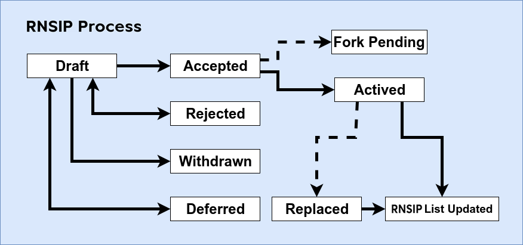

# RNSIP Purpose and Guidelines

|RNSIP          |01           |
| :------------ |:-------------|
|**Title**      |RNSIP Purpose and Guidelines |
|**Created**    |27-SEP-18 |
|**Author**     |JL |
|**Purpose**    | |
|**Layer**      | |
|**Complexity** |2 |
|**Status**     |Active |

## What is a RNSIP?

RNSIP stands for RSK Name Service Improvement Proposal. A RNSIP is a design document providing information to the RNS community, or describing a new feature for RNS or its processes or environment. The RNSIP should provide a consise technical specification of the feature and a rationale for the feature. 

## RNSIP Rational

We intend RNSIPs to be the primary mechanisms for proposing new features, for collecting community input on an issue, and for documenting the design decisions that have gone into RNS. Because the RNSIPs are maintained as text files in a versioned repository, their revision history is the historical record of the feature proposal.

For RNS implementers, RNSIPs are a convenient way to track the progress of their implementation. Ideally each implementation maintainer would list the RNSIPs that they have implemented. This will give end users a convenient way to know the current status of a given implementation or library.

## RNSIP Types

There are three types of RNSIP:

-	A **Standard Track RNSIP** describes any change that affects most or all RNS implementation, such as a change to the network protocol, a change in block or transaction validity rules, or any chance or addition that affects the interoperability of applications using RNS. Furthermore Standard RNSIPs can be broken down into the following categories.
	* **CORE** - CORE, consensus related
	* **Node** - Related to node manager interfaces, such as RPC
	* **Net** - related to p2p networking
	* **UI** - User Interface
	* **2nd** - 2nd layer protocols, such as off-chain payment channels
	* **DApp** - Dapp application interfaces
- An **Informational RNSIP** describes a RNS design issue, or provides general guidelines or information to the RNS community, but does not propose a new feature. Informational RNSIPs do not necessarily represent a RNS community consensus or recommendation, so users and implementors are free to ignore Informational RNSIPs or follow their advice.
- A **Process RNSIP** describes a process surrounding RNS, or proposes a change to (or an event in) a process. Process RNSIPs are like Standards Track RNSIPs but apply to areas other than the RNS protocol itself. They may propose an implementation, but not to RNS's codebase; they often require community consensus; unlike Informational RNSIPs, they are more than recommendations, and users are typically not free to ignore them. Examples include procedures, guidelines, changes to the decision-making process, and changes to the tools or environment used in RNS development. Any meta-RNS is also considered a Process RNS.

## RNSIP purpose terms

Describes what aspects of RNS improves

* **Sca** - an RNSIP that improves scalability
* **Usa** - an RNSIP that improves usability
* **Fair** - an RNSIP that has improves fairness
* **Sec** - an RNSIP that that improves security

## RNSIP purpose complexity

It is also necessary to describe the complexity of the improvement with the following levels

* **1** - Minimal
* **2** - Medium
* **3** - High

## RNSIP Work Flow

The RNSIP repository Collaborators change the RNSIPs status. Please send all RNSIP-related email to the RNSIP Editors, which is listed under RNSIP Editors below. Also see RNSIP Editor Responsibilities & Workflow.

The RNSIP process begins with a new idea for RNS. It is highly recommended that a single RNSIP contain a single key proposal or new idea. The more focused the RNSIP, the more successful it tends to be. A change to one client doesn't require an RNSIP; a change that affects multiple clients, or defines a standard for multiple apps to use, does. The RNSIP editor reserves the right to reject RNSIP proposals if they appear too unfocused or too broad. If in doubt, split your RNSIP into several well-focused ones.

Each RNSIP must have a champion -- someone who writes the RNSIP using the style and format described below, shepherds the discussions in the appropriate forums, and attempts to build community consensus around the idea. The RNSIP champion (a.k.a. Author) should first attempt to ascertain whether the idea is RNSIP-able. 

Vetting an idea publicly before going as far as writing an RNSIP is meant to save the potential author time. Asking the RNS community first if an idea is original helps prevent too much time being spent on something that is guaranteed to be rejected based on prior discussions. It also helps to make sure the idea is applicable to the entire community and not just the author. Just because an idea sounds good to the author does not mean it will work for most people in most areas where RNS is used. Examples of appropriate public forums to gauge interest around your RNSIP include [the RNS subreddit] and [the Issues section of this repository].

Once the champion has asked the RNS community whether an idea has any chance of acceptance a draft RNSIP should be presented as a [pull request]. This gives the author a chance to continuously edit the draft RNSIP for proper formatting and quality. This also allows for further public comment and the author of the RNSIP to address concerns about the proposal.

If the RNSIP editor approves, the issuer of the RNSIP must assign the PR number to the RNSIP, renaming it. Then label it as Standards Track, Informational, or Process, give it status "Draft", in addition the editor will put what level the RNSIP has and what kind of improvement is, and then add it to the git repository. The RNSIP editor will not unreasonably deny a RNSIP. Reasons for denying RNSIP status include duplication of effort, being technically unsound, not providing proper motivation or addressing backwards compatibility, or not in keeping with the RNS philosophy.

The RNSIP author may update the Draft as necessary in the git repository. Updates to drafts may also be submitted by the author as pull requests.

Standards Track RNSIPs consist of three parts, a design document, implementation, and finally if warranted an update to the formal specification. The RNSIP should be reviewed and accepted before an implementation is begun, unless a reference implementation will aid people in studying the RNSIP. 

Standards Track RNSIPs must include an implementation -- in the form of code, a patch, or a URL to same -- before it can be considered Actived or Pending Fork.

RNSIP authors are responsible for collecting community feedback on a RNSIP before submitting it for review. However, wherever possible, long open-ended discussions on public mailing lists should be avoided. Strategies to keep the discussions efficient include: setting up a separate SIG mailing list for the topic, having the RNSIP author accept private comments in the early design phases, setting up a wiki page or git repository, etc. RNSIP authors should use their discretion here.

For a RNSIP to be "Accepted" it must meet certain minimum criteria. It must be a clear and complete description of the proposed enhancement. The enhancement must represent a net improvement. The proposed implementation, if applicable, must be solid and must not complicate the protocol unduly.
Once a RNSIP has been Accepted, the implementations must be completed. When the implementation is complete and accepted by the community, the status will be changed to “Pending Fork” if it is neccesary a hard or soft fork, and Actived if not.

A RNSIP can also be assigned status “Deferred”. The RNSIP author or editor can assign the RNSIP this status when no progress is being made on the RNSIP. Once a RNSIP is deferred, the RNSIP editor can re-assign it to draft status. A RNSIP that is not being considered for immediate adoption in the reference client, may be reconsidered in the future for a subsequent release of the reference client.

A RNSIP can also be “Rejected”. Perhaps after all is said and done it was not a good idea. It is still important to have a record of this fact.

RNSIPs can also be superseded by a different RNSIP, rendering the original obsolete. 

The possible paths of the status of RNSIPs are as follows:

  

## What belongs in a successful RNSIP?

Each RNSIP should have the following parts:

-	Preamble -- RFC 822 style headers containing meta-data about the RNSIP, including the RNSIP number, a short descriptive title (limited to a maximum of 44 characters), the names, and optionally the contact info for each author, etc.
<!-- -->

-	Abstract -- a short (~200 word) description of the technical issue being addressed.
<!-- -->

-	 Motivation -- The motivation is critical for RNSIPs that want to change a RNS protocol. It should clearly explain why the existing protocol specification is inadequate to address the problem that the RNSIP solves. RNSIP submissions without sufficient motivation may be rejected outright.
<!-- -->

-	Specification -- The technical specification should describe the syntax and semantics of any new feature. The specification should be detailed enough to allow competing, interoperable implementations for any of the current RNS platforms.
<!-- -->

-	Rationale -- The rationale fleshes out the specification by describing what motivated the design and why particular design decisions were made. It should describe alternate designs that were considered and related work, e.g. how the feature is supported in other languages. The rationale should provide evidence of consensus within the community and discuss important objections or concerns raised during discussion.
<!-- -->

-	Backwards Compatibility -- All RNSIPs that introduce backwards incompatibilities must include a section describing these incompatibilities and their severity. The RNSIP must explain how the author proposes to deal with these incompatibilities. RNSIP submissions without a sufficient backwards compatibility treatise may be rejected outright.
<!-- -->

-	Implementations - The implementations must be completed before any RNSIP is given status “Final”, but it need not be completed before the RNSIP is accepted. While there is merit to the approach of reaching consensus on the specification and rationale before writing code, the principle of “rough consensus and running code” is still useful when it comes to resolving many discussions of API details.
<!-- -->

-	Test Cases - Test cases for an implementation are mandatory for RNSIPs that are affecting consensus changes. Other RNSIPs can choose to include links to test cases if applicable.
<!-- -->

-	Copyright Waiver - All RNSIPs must be in public domain. See the bottom of this RNSIP for an example copyright waiver.
<!-- -->

-	The final implementation must include test code and documentation appropriate for a RNS protocol.

## RNSIP Formats and Templates

RNSIPs should be written in markdown format. Image files should be included in a subdirectory for that RNSIP.

## RNSIP Header Preamble

Each RNSIP must begin with an RFC 822 style header preamble. The headers must appear in the following order. Headers marked with "*" are optional and are described below. All other headers are required.

` RNSIP: ` <RNSIP number> (this is determined by the RNSIP editor)
	
` Title: `<RNSIP title>

` Author: `<list of author's real names and optionally, email address>

` * Discussions-To: ` <email address or url>

` Status: `<Draft | Active | Accepted | Deferred | Rejected | Withdrawn | Adopted | Superseded>

` Type: `<Standards Track | Informational | Process>

` Created: `<date created on, in ISO 8601 (yyyy-mm-dd) format>

` * Replaces: `<RNSIP number>

` * Superseded-By: `<RNSIP number>

` * Resolution: `<url>

The Author header lists the names, and optionally the email addresses of all the authors/owners of the RNSIP. The format of the Author header value must be

 Random J. User <address@dom.ain>
if the email address is included, and just

 Random J. User
if the address is not given.

If there are multiple authors, each should be on a separate line following RFC 2822 continuation line conventions.

Note: The Resolution header is required for Standards Track RNSIPs only. It contains a URL that should point to an email message or other web resource where the pronouncement about the RNSIP is made.

While a RNSIP is in private discussions (usually during the initial Draft phase), a Discussions-To header will indicate the mailing list or URL where the RNSIP is being discussed. No Discussions-To header is necessary if the RNSIP is being discussed privately with the author, or on the RNS email mailing lists.

The Type header specifies the type of RNSIP: Standards Track, Informational, or Process. If the track is Standards please include the subcategory (core, networking, interface, etc).

The Created header records the date that the RNSIP was assigned a number, while Post-History is used to record the dates of when new versions of the RNSIP are posted to RNS mailing lists. Both headers should be in yyyy-mm-dd format, e.g. 1994-08-12.

RNSIPs may have a Requires header, indicating the RNSIP numbers that this RNSIP depends on.

RNSIPs may also have a Superseded-By header indicating that a RNSIP has been rendered obsolete by a later document; the value is the number of the RNSIP that replaces the current document. The newer RNSIP must have a Replaces header containing the number of the RNSIP that it rendered obsolete.

## Auxiliar Files

RNSIPs may include auxiliary files such as diagrams. Such files must be named RNSIP-XXXX-Y.ext, where "XXXX" is the RNSIP number, "Y" is a serial number (starting at 1), and "ext" is replaced by the actual file extension (e.g. "png").

## Transferring RNSIP Ownership

It occasionally becomes necessary to transfer ownership of RNSIPs to a new champion. In general, we'd like to retain the original author as a co-author of the transferred RNSIP, but that's really up to the original author. A good reason to transfer ownership is because the original author no longer has the time or interest in updating it or following through with the RNSIP process, or has fallen off the face of the 'net (i.e. is unreachable or not responding to email). A bad reason to transfer ownership is because you don't agree with the direction of the RNSIP. We try to build consensus around a RNSIP, but if that's not possible, you can always submit a competing RNSIP.

If you are interested in assuming ownership of a RNSIP, send a message asking to take over, addressed to both the original author and the RNSIP editor. If the original author doesn't respond to email in a timely manner, the RNSIP editor will make a unilateral decision (it's not like such decisions can't be reversed :).

## RNSIP Editors

` * Sergio Lerner (@sergioLerner) `

## RNSIP Editor Responsibilities and Workflow

For each new RNSIP that comes in, an editor does the following:

- Read the RNSIP to check if it is ready: sound and complete. The ideas must make technical sense, even if they don't seem likely to be accepted.
- The title should accurately describe the content.
- Edit the RNSIP for language (spelling, grammar, sentence structure, etc.), markup, code style.
If the RNSIP isn't ready, the editor will send it back to the author for revision, with specific instructions.

Once the RNSIP is ready for the repository, the RNSIP editor will:

- Add the RNSIP to the rnsdomains/RNSIPs repository on GitHub.
- List the RNSIP in README.md
- Send a message back to the RNSIP author with next step.

Many RNSIPs are written and maintained by developers with write access to the RNS codebase. The RNSIP editors monitor RNSIP changes, and correct any structure, grammar, spelling, or markup mistakes we see.

The editors don't pass judgment on RNSIPs. We merely do the administrative & editorial part.

## History

This document was derived heavily from [Ethereum's EIP-1] written by Martin Becze and from [Bitcoin's BIP-0001] written by Amir Taaki which in turn was derived from [Python's PEP-0001]. In many places text was simply copied and modified. Although the PEP-0001 text was written by Barry Warsaw, Jeremy Hylton, and David Goodger, they are not responsible for its use in the RNS Improvement Process, and should not be bothered with technical questions specific to RNS or the RNSIP. Please direct all comments to the RNSIP editors.

  [the RSK subreddit]: https://www.reddit.com/r/rootstock/
  [formal specification]: https://github.com/ethereum/yellowpaper
  [the Issues section of this repository]: https://github.com/rnsdomains/RNSIPs/issues
  [markdown]: https://github.com/adam-p/markdown-here/wiki/Markdown-Cheatsheet
  [README.md]: README.md "wikilink"
  [Bitcoin's BIP-0001]: https://github.com/bitcoin/bips/blob/master/bip-0001.mediawiki
  [Python's PEP-0001]: https://www.python.org/dev/peps/
  [Ethereum's EIP-1]: https://github.com/ethereum/EIPs/blob/master/EIPS/eip-1.md
  [pull request]: https://github.com/rootstock/RNSIPs/pulls

---------
## Copyright

Copyright and related rights waived via [CC0](https://creativecommons.org/publicdomain/zero/1.0/).
